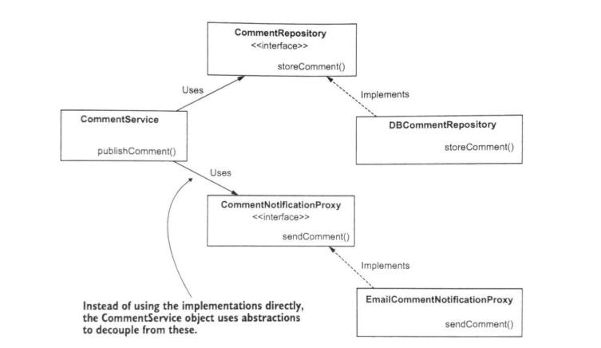

## Concept: Interfaces

Loose coupling = less code changes.

We don't want to have to make a lot of code changes if some implementation detail changes. We should write code
that doesn't care about implementation details, only _what_ we need/want to do in the code.

Interfaces define a contract : the what we need/want. If we code to interfaces, we are defining the need/want,
and allow for implementation details to be whatever the heck we need them to be without all the code change.

## What we are implementing:
