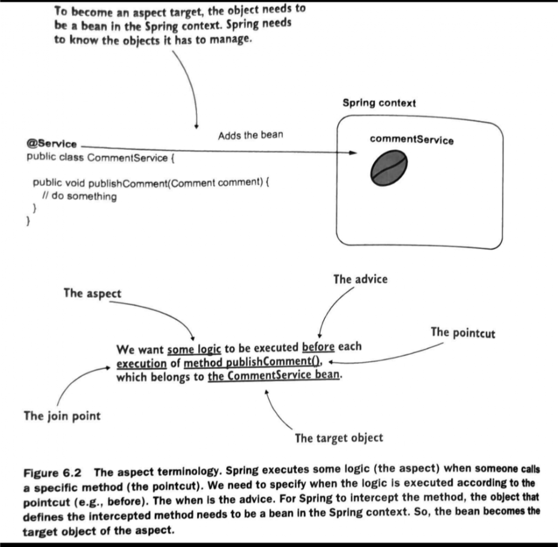

# Concept: Aspects
### Aspect Oriented Programming (AOP)

The way the concept has presented to me is in the following way:

Say you have some business logic in a class that does some xyz task. That's all it should do according to the Gods that
be. However, sometiems we want to log what the class is doing in order to debug the code. Instead of putting all the
logs in the same class/method, we can move it out using this "aspect-oriented-programming" to make the code look clean.

#### Book Definition
An aspect is simply a piece of logic that Spring will execute when you call specific methods. That "piece of logic" that
executes is called an "aspect". You will need to think about the following when creating/defining/using aspects:
* What piece of code you want to execute. That is the aspect itself.
* When the piece of code should be executed. (I.E. before a certain method, after a certain method, or _instead_ of a
  certain method). When the code is executed is called the _advice_
* Which methods you will need to intercept and execute the aspect for. This is called a _pointcut._

#### How you will use them
In order to use aspects, you need to tell spring which objects you want to apply aspects on. We'll define beans and shit
like you always do on freaking Spring. The special bean that declares the method intercepted by an aspect is called
the _target object_ 

Here is a picture that clears things up apparently:

